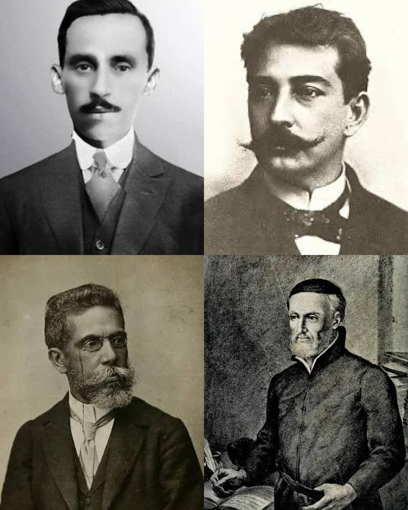

# Semantic Stress Lab

Adversarial research on how literary syntactic complexity — antithesis,
euphemism, neologism, paradox, zeugma, parody, and related rhetorical
phenomena — degrades embedding fidelity and induces hallucination /
reasoning breakdown in LLMs during interpretation tasks (RAG). This
project tests **Portuguese-language texts specifically**: the corpus is
built from public-domain Brazilian literature (Padre Antônio Vieira,
Machado de Assis, Augusto dos Anjos, Mário de Andrade, Aluísio Azevedo),
pairing each original fragment with an "intralingual translation" — a
simplified, semantically equivalent rewrite in contemporary Portuguese.

The experiment runs in two phases:

- **Phase 1 — Embedding Spatial Drift**: compares the cosine similarity
  between original and simplified fragments using multiple embedding
  models (BGE-M3, LaBSE, EmbeddingGemma), so results don't depend on a
  single architecture.
- **Phase 2 — Interpretive Blindness**: submits original and simplified
  fragments to multiple LLMs (Gemini 2.5 Flash, Qwen3 via local Ollama,
  Llama 3.3 via Groq) and classifies the responses to detect hallucination
  or reasoning breakdown induced by syntactic complexity.

Full methodology, including the intralingual translation protocol and the
bidirectional entailment check, in [`docs/METHODOLOGY.md`](docs/METHODOLOGY.md).
Annotation criteria in [`docs/ANNOTATION_GUIDE.md`](docs/ANNOTATION_GUIDE.md).

## Current status

✅ Pilot dataset (`data/annotation/dataset_v0_draft.csv`, 12 annotated
pairs) built, validated, and converted to
`data/processed/dataset_v0.jsonl` via the schema in
`src/dataset/schema.py` (`DatasetEntry`) and
`src/dataset/csv_to_jsonl.py`.

✅ **Phase 1** implemented in `src/embeddings/` and run on the pilot
dataset with all three embedding models (BGE-M3, LaBSE, EmbeddingGemma),
complete for all 12 pairs, no missing values. Results in
[`results/phase1_embeddings/cosine_similarity_by_model.csv`](results/phase1_embeddings/cosine_similarity_by_model.csv)
— see [Phase 1 results](#phase-1-results-embedding-spatial-drift) below.

🚧 **Phase 2** (LLM evaluation, `src/llm_eval/`) partially implemented and
piloted with a single model (Qwen3, local Ollama): question generation
(`questions.py`), the Ollama client (`ollama_client.py`), and the raw
data-collection run (`run_phase2_pilot.py`) are done, with results in
[`results/phase2_llm_eval/pilot_qwen3_raw.jsonl`](results/phase2_llm_eval/pilot_qwen3_raw.jsonl)
— see [Phase 2 pilot results](#phase-2-pilot-results-interpretive-blindness-qwen3-only)
below. Multi-model comparison (Gemini 2.5 Flash, Llama 3.3 via Groq) and
systematic response classification (`classify_responses.py`) are not
implemented yet.

## Phase 1 results: embedding spatial drift

Cosine similarity between `texto_original` and `texto_simplificado`,
averaged across the 12 pilot pairs, per model:

| Model | Mean | Std dev |
|---|---|---|
| BGE-M3 | 0.6899 | 0.0938 |
| LaBSE | 0.6521 | 0.1355 |
| EmbeddingGemma | 0.6158 | 0.1405 |

EmbeddingGemma has both the lowest mean and the highest variance of the
three — it appears the most sensitive to the syntactic complexity of the
original fragment in this pilot.

By `fenomeno_linguistico` (sorted by mean similarity across the three
models, lowest first — pilot dataset, n=1 pair per phenomenon):

| Phenomenon | BGE-M3 | LaBSE | EmbeddingGemma |
|---|---|---|---|
| Paradoxo | 0.5067 | 0.3357 | 0.3357 |
| Niilismo Ontológico / Não Ser | 0.5911 | 0.5519 | 0.5210 |
| Niilismo Ontológico / Antinomia e Oximoro | 0.6373 | 0.5711 | 0.5200 |
| Neologismo e Sarcasmo | 0.6379 | 0.5435 | 0.5805 |
| Niilismo Fís / Estática do Nada | 0.6873 | 0.6594 | 0.5588 |
| Niilismo Filosófico / Desconstrução Metafísica | 0.6806 | 0.7002 | 0.5401 |
| Antítese | 0.7103 | 0.7440 | 0.5962 |
| Eufemismo e Ironia | 0.7060 | 0.7021 | 0.7003 |
| Metáfora Cósmica / Niilismo Físico | 0.7610 | 0.6957 | 0.6780 |
| Paródia | 0.7118 | 0.7113 | 0.7464 |
| Sugestão e Conotação | 0.7724 | 0.7423 | 0.7382 |
| Zeugma | 0.8769 | 0.8681 | 0.8742 |

**Cross-architecture agreement at the extremes** is the most notable
finding so far: all three models — architecturally unrelated (BGE-M3,
LaBSE's BERT-based dual encoder, and EmbeddingGemma's Gemma 3 backbone) —
agree on both ends of the distribution. The lowest similarity is
`vieira_002` (Padre Antônio Vieira, *Paradoxo*, "arte sem arte"), where
LaBSE and EmbeddingGemma converge on the exact same value (0.3357); the
highest is `assis_002` (Machado de Assis, *Zeugma*), where all three land
in the 0.87–0.88 range. This convergence across independent architectures
is evidence against a single-model artifact, in support of the project's
core hypothesis: paradox — a phenomenon with genuine surface-level logical
tension — appears to systematically stress embedding geometry, while
zeugma — a purely syntactic ellipsis with no semantic ambiguity — does
not.

With n=1 pair per phenomenon, this pilot is descriptive, not statistically
conclusive — expanding the annotated dataset is needed before drawing
firm conclusions per phenomenon.

## Phase 2 pilot results: interpretive blindness (Qwen3 only)

For each of the 12 pilot pairs, two hand-written questions were asked
about *both* `texto_original` and `texto_simplificado` (same wording,
same expected answer where applicable) — see
[`data/processed/interpretation_questions.jsonl`](data/processed/interpretation_questions.jsonl):

- a **closed true/false question** about a specific propositional fact,
  objectively checkable and identical for both versions;
- an **open question** asking for an interpretation of the fragment's
  meaning/intention.

All 48 raw responses (`qwen3:8b`, local Ollama) are in
[`results/phase2_llm_eval/pilot_qwen3_raw.jsonl`](results/phase2_llm_eval/pilot_qwen3_raw.jsonl),
unclassified — this pilot round was reviewed manually rather than scored
automatically. Analysis below covers only the 24 closed-question
responses; the 24 open-question responses have not been analyzed yet.

| id | fenomeno_linguistico | acertou_original | acertou_simplificado |
|---|---|---|---|
| vieira_001 | Antítese | sim | sim |
| assis_001 | Eufemismo e Ironia | **não** | sim |
| anjos_001 | Metáfora Cósmica / Niilismo Físico | sim | sim |
| anjos_002 | Niilismo Fís / Estática do Nada | sim | **não** |
| anjos_003 | Niilismo Ontológico / Antinomia e Oximoro | sim | sim |
| anjos_004 | Niilismo Ontológico / Não Ser | sim | sim |
| andrade_001 | Neologismo e Sarcasmo | sim | sim |
| anjos_005 | Niilismo Filosófico / Desconstrução Metafísica | sim | sim |
| vieira_002 | Paradoxo | sim | sim |
| andrade_002 | Paródia | sim | sim |
| azevedo_001 | Sugestão e Conotação | sim | sim |
| assis_002 | Zeugma | sim | sim |

- Closed-question accuracy on `texto_original`: **11/12 (91.7%)**
- Closed-question accuracy on `texto_simplificado`: **11/12 (91.7%)**
- Difference: **0 points** — at this sample size (n=12), the aggregate
  closed-question score shows no interpretive blindness effect.

Only two pairs diverge between versions, in opposite directions:

- `assis_001` (**Eufemismo e Ironia**) — wrong on original, correct on
  simplified. This is the signal the hypothesis predicts: the model
  answered "Falso" to the original's euphemism ("...foram estudar a
  geologia dos campos santos"), missing that it means the friends died,
  and only got it right once the simplified version made "morreram e
  foram enterrados" explicit.
- `anjos_002` (**Niilismo Fís / Estática do Nada**) — correct on
  original, wrong on simplified, but for a likely question-design
  artifact rather than a semantic one: the closed question is worded
  around the exact phrase "milhões de mundos", which survives verbatim
  in `texto_original` but was paraphrased to "planetas inteiros" (no
  explicit quantity) in `texto_simplificado`. The model's "Falso" cites
  that literal mismatch. Discounting this pair, the only clean signal in
  this pilot favoring the hypothesis is `assis_001`.

**Reading**: with true/false questions this direct, `qwen3:8b` performed
near-ceiling on both versions in this pilot — too little room for errors
to distinguish original from simplified at n=12. The open-question
responses (not analyzed yet) are the more promising place to look for a
qualitative interpretive-blindness effect, since open answers have much
more room to be subtly wrong than a binary choice does.

## Project structure

```
assets/           static images (e.g. project photos)
data/
  raw/            extracted original texts, organized by author
  processed/      final consolidated dataset (.jsonl) and Phase 2 questions
  annotation/     working spreadsheets/CSVs for human review
src/
  dataset/        dataset construction and validation (schema, CSV -> JSONL)
  embeddings/     embedding models, cosine similarity, Phase 1 pipeline
  llm_eval/       Phase 2: questions.py, ollama_client.py, run_phase2_pilot.py
                  (Qwen3/Ollama only so far); query_llms.py and
                  classify_responses.py (multi-model, classification) — stubs
notebooks/        exploratory analysis
docs/             METHODOLOGY.md, ANNOTATION_GUIDE.md
results/          experiment outputs, plots, tables
tests/            automated tests
```

## Environment setup

```bash
python3 -m venv .venv
source .venv/bin/activate
pip install -r requirements.txt
```

Configure the API keys needed for Phase 2:

```bash
cp .env.example .env
# edit .env with GOOGLE_API_KEY and GROQ_API_KEY
```

Qwen3 runs locally via [Ollama](https://ollama.com/) — no key required, but
the service must be running (`ollama serve`) and the model pulled (e.g.
`ollama pull qwen3:8b`; the tag actually pulled must match
`DEFAULT_MODEL` in `src/llm_eval/ollama_client.py`, or be passed via
`--model`).

EmbeddingGemma (used in Phase 1) is a gated model: accept the license at
[google/embeddinggemma-300m](https://huggingface.co/google/embeddinggemma-300m)
and authenticate with `huggingface-cli login` (or set `HF_TOKEN`) before
running Phase 1 with all three embedding models.

## How to run

**Build the dataset** from an annotation spreadsheet:

```bash
python -m src.dataset.csv_to_jsonl \
  --input data/annotation/dataset_v0_draft.csv \
  --output data/processed/dataset_v0.jsonl
```

See `data/annotation/exemplo.csv` for the expected column format (one per
field of `DatasetEntry` in `src/dataset/schema.py`). Validation errors are
collected across all rows and reported together; the `.jsonl` file is only
written if every row passes validation.

**Run the tests**:

```bash
pytest
```

**Generate embeddings and compute cosine similarity** (Phase 1):

```bash
# quick smoke test on a single pair first
python -m src.embeddings.run_phase1 --ids vieira_001 --output /tmp/test.csv

# full run
python -m src.embeddings.run_phase1
```

**Run LLM evaluation** (Phase 2, Qwen3/Ollama pilot only):

```bash
# 1. (Re)generate the interpretation questions from src/llm_eval/questions.py
#    into data/processed/interpretation_questions.jsonl — review/edit that
#    file by hand before running the pilot.
python -m src.llm_eval.questions

# 2. quick smoke test on a single pair first
python -m src.llm_eval.run_phase2_pilot --ids vieira_001

# 3. full pilot run (12 pairs x 4 tasks = 48 Ollama calls)
python -m src.llm_eval.run_phase2_pilot
```

This only collects raw responses in
`results/phase2_llm_eval/pilot_qwen3_raw.jsonl` — see
[Phase 2 pilot results](#phase-2-pilot-results-interpretive-blindness-qwen3-only)
above for the closed-question analysis. Multi-model comparison and
systematic classification are not implemented yet — see the TODOs in
`src/llm_eval/query_llms.py` and `src/llm_eval/classify_responses.py`.

---

<p align="center">
  <br>
  <em>Authors</em>
</p>
